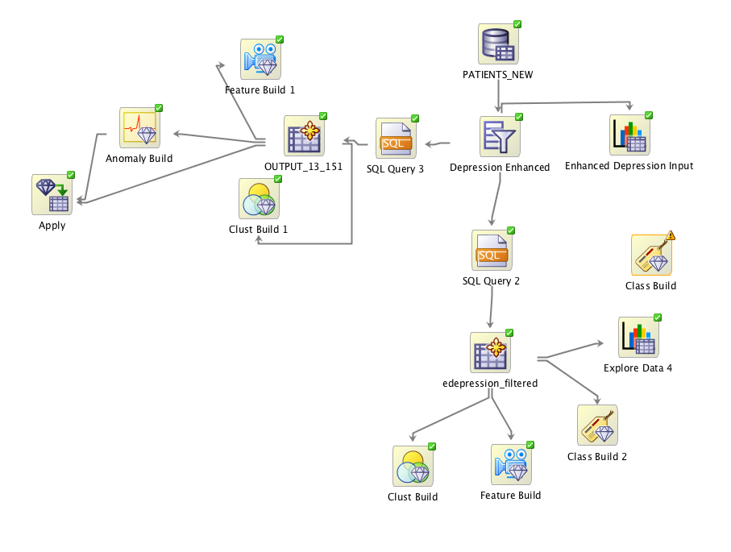
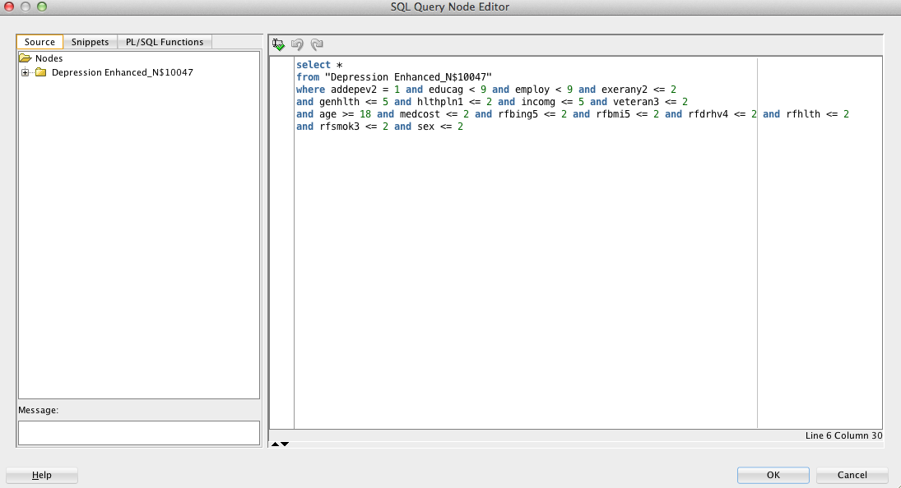
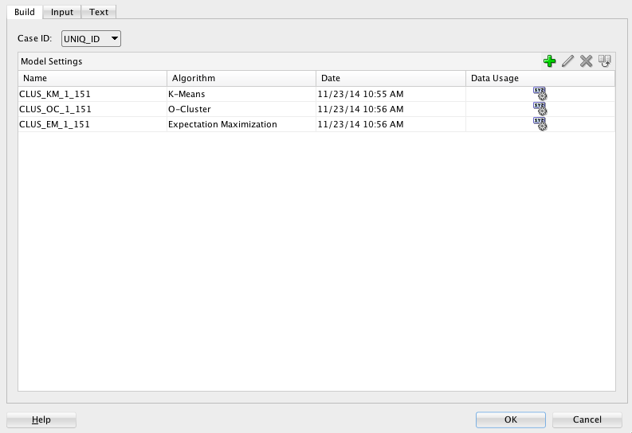
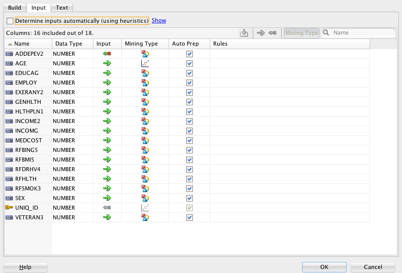
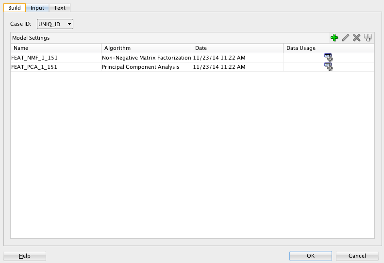
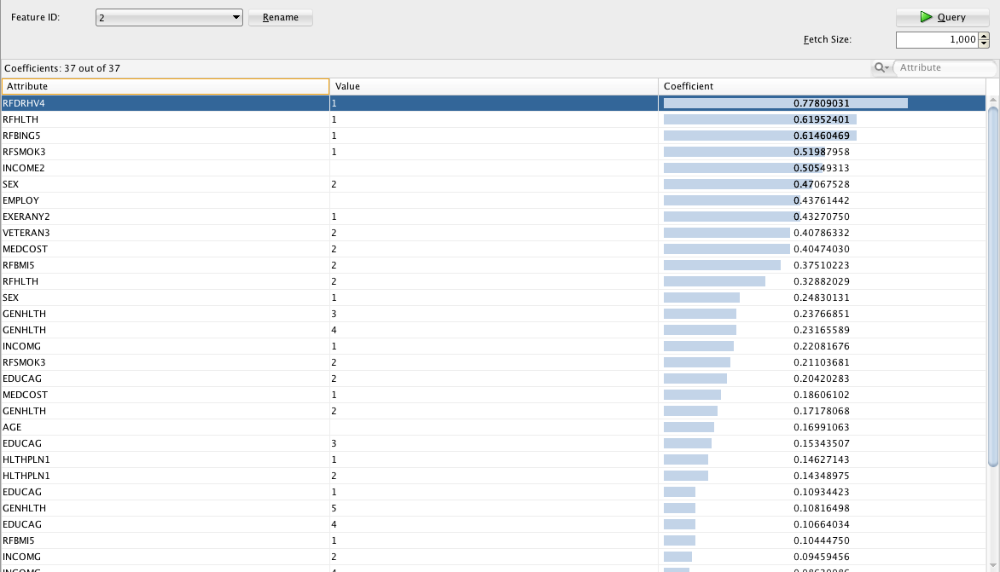
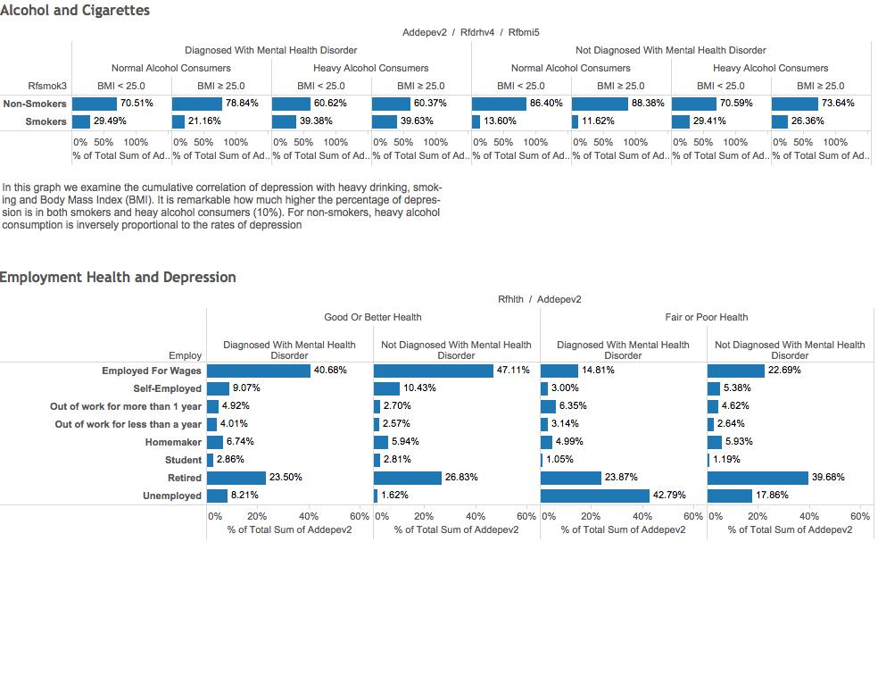
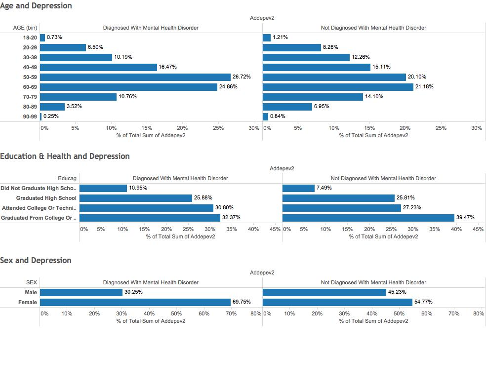
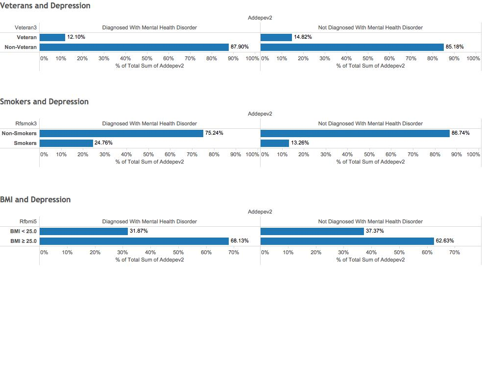

Medicare Presentation
=====================

##Case Study: Depression
In our research, we wanted to identify factors with high correlation to the existence of depression or other mental health disorders.

###Dataset
The dataset which was used included answers from a phone survey that took place in 2011-2012. Most questions related to behaviors resulting in leading causes of premature mortality and morbidity among adults. Over 139.000 responses were collected to 177 such questions. 

####Selected Attributes
18 attributes were chosen and extracted from the dataset as the basis of our examination in order to determine which factors have the highest correlation to mental disorders or depression. After all null values were eliminated from our selection, we had a remaining 108.544 rows.

| Attribute  | Meaning |
| ------------- | ------------- |
| ADDEPEV2  | Ever told you had a depressive disorder?  |
| AGE  | Age  |
| EDUCAG  | Level of education (1-4)  |
| EMPLOY  | Employment Status (1-5)  |
| EXERANY1  | Exercise in past 30 days |
| GENHLTH  | Would you say that in general your health is? (1-5; Excellent-Poor)  |
| HLTHPLN1  | Do you have any kind of health coverage?  |
| INCOME2  | Income Level (1-8) |
| INCOMG  | Computed Income Categories (1-5) |
| MEDCOST  | Was there a time in the past 12 months, when you could not see a doctor because of the cost?  |
| RFBING5  | Binge Drinking Calculated Variable  |
| RFBMI5  | Overweight or obese calculated variable (BMI > 25.0)  |
| RFDRHV4  | Heavy Alcohol Consumption Calculated Variable  |
| RFHLTH  | Adults with good or better health  |
| RFSMOK3  | Adults who are currently smokers  |
| SEX  | Sex  |
| VETERAN3  | Are you a veteran? |

###Oracle Data Miner Workflow

####Filtering Null Values

####Explore Data Node on Filtered Values

####Depression Clustering

####Feature Build Node

####NMF Feature Build Coefficients
Each feature created by NMF is a linear combination of the original attribute set. Each 
feature has a set of coefficients, which are a measure of the weight of each attribute on 
the feature. There is a separate coefficient for each numerical attribute and for each 
distinct value of each categorical attribute. The coefficients are all non-negative.

###Plots and Graphs

